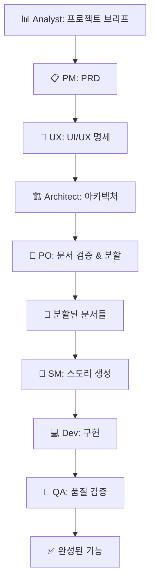
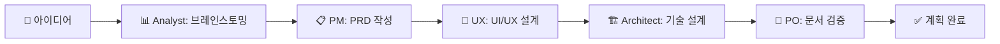
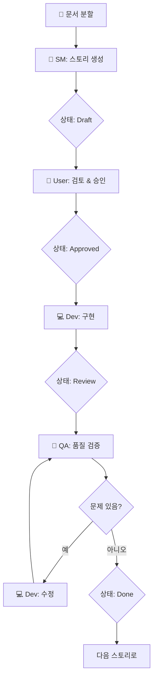
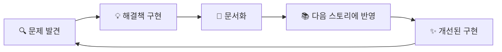
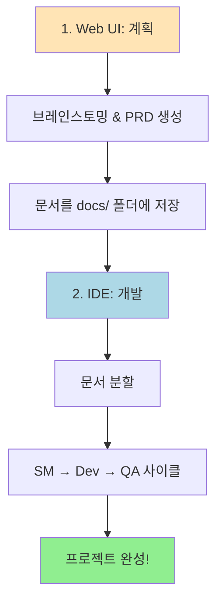

# 🚀 BMAD Method™ 완벽 가이드: AI 에이전트로 소프트웨어 개발하기

## 📖 BMAD란 무엇인가?

**BMAD™ (Breakthrough Method of Agile AI-driven Development)**는 AI 에이전트들을 활용해 소프트웨어를 개발하는 혁신적인 프레임워크입니다. 

### 🎯 핵심 개념: "당신은 Vibe CEO"

BMAD에서 당신은 **"Vibe CEO"**가 됩니다:
- 🎨 **비전 제시자**: 무엇을 만들지 결정
- 🎯 **품질 관리자**: 결과물 검토 및 승인
- 🚀 **전략 감독자**: 전체 방향성 유지

AI 에이전트들은 당신의 **"무한한 자원을 가진 최고의 팀"**입니다!

---

## 🏗️ BMAD의 2단계 접근법

### 📝 **1단계: 계획 (Web UI 추천 - 특히 Gemini!)**

**왜 Web UI인가요?**
- 💰 **비용 효율적**: Gemini의 100만 토큰 컨텍스트 활용
- 📚 **대용량 문서 생성**: PRD, Architecture 문서를 한 번에
- 🤝 **다중 에이전트 협업**: 브레인스토밍과 분석

### 💻 **2단계: 개발 (IDE 환경)**

**왜 IDE인가요?**
- 📁 **파일 작업**: 실시간 코드 생성 및 수정
- 🔄 **반복 개발**: SM → Dev → QA 사이클
- 🎯 **집중된 작업**: 하나의 스토리씩 완성

---

## 👥 BMAD의 전문가 에이전트 팀

### 🎭 각 에이전트의 역할과 전문성

| 에이전트 | 이름 | 역할 | 주요 산출물 | 언제 사용? |
|---------|------|------|------------|-----------|
| 📊 **Analyst** | Mary | 비즈니스 분석가 | - 프로젝트 브리프<br>- 시장 조사<br>- 경쟁사 분석 | 프로젝트 시작, 아이디어 구체화 |
| 📋 **PM** | John | 제품 관리자 | - PRD (제품 요구사항)<br>- 로드맵<br>- 우선순위 결정 | 제품 전략 수립 |
| 🎨 **UX Expert** | Sally | UX 디자이너 | - UI/UX 명세<br>- 와이어프레임<br>- 디자인 시스템 | 사용자 경험 설계 |
| 🏗️ **Architect** | Winston | 솔루션 아키텍트 | - 기술 아키텍처<br>- 기술 스택 결정<br>- 시스템 설계 | 기술 구조 설계 |
| 📝 **PO** | Sarah | 제품 오너 | - 백로그 관리<br>- 스토리 검증<br>- 문서 분할 | 요구사항 검증 |
| 🏃 **SM** | Bob | 스크럼 마스터 | - 스토리 생성<br>- 스프린트 계획 | 개발 작업 준비 |
| 💻 **Dev** | James | 개발자 | - 코드 구현<br>- 테스트 작성<br>- 디버깅 | 실제 개발 |
| 🧪 **QA** | Quinn | 품질 관리자 | - 코드 리뷰<br>- 테스트 검증<br>- 품질 게이트 | 품질 보증 |

### 🎮 메타 에이전트 (통합 관리자)

- **🎭 BMad Orchestrator**: 모든 에이전트 역할 수행 가능, 워크플로우 조정
- **🔮 BMad Master**: 단일 세션에서 모든 작업 수행 (하지만 전문 에이전트 사용 권장!)

---

## 📚 BMAD 문서 생태계: 지식의 흐름

### 🌊 문서는 어떻게 흐르는가?



### 📄 핵심 문서들과 그 관계

#### 1️⃣ **설계 문서 (Planning Documents)**

**PRD (Product Requirements Document)**
```markdown
# PRD 구조
## 목표와 배경
- 무엇을 만들 것인가?
- 왜 필요한가?

## 요구사항
- FR1: 기능적 요구사항
- NFR1: 비기능적 요구사항

## Epic 구조
- Epic 1: 프로젝트 기초
  - Story 1.1: 프로젝트 설정
  - Story 1.2: 인증 시스템
```

**Architecture Document**
```markdown
# 아키텍처 문서 구조
## 기술 스택
- Frontend: Next.js 14
- Backend: Supabase
- 3D: Three.js r169

## 시스템 설계
- 컴포넌트 구조
- API 설계
- 데이터베이스 스키마
```

#### 2️⃣ **개발 문서 (Development Documents)**

**Story Document - 모든 지식의 허브**
```markdown
# Story 2.1: 3D 컨피규레이터 구축

## 상태
Draft → Approved → InProgress → Review → Done

## 스토리
As a 사용자,
I want 3D 모델을 조작할 수 있게
So that 제품을 시각적으로 확인할 수 있다

## Acceptance Criteria
1. 3D 모델 로딩 성공
2. 마우스로 회전 가능
3. 줌 인/아웃 지원

## Dev Notes (SM이 작성)
- 참조: docs/architecture/three-js-setup.md
- 참조: Story 1.3 QA Results (성능 최적화 팁)
- Three.js r169 사용
- WebGL 컨텍스트 초기화 필요

## Dev Agent Record (Dev가 작성)
### 완료 노트
- Three.js 환경 구축 완료
- OrbitControls 적용
- 60fps 렌더링 달성

### 파일 목록
- 생성: src/components/three/ThreeCanvas.tsx
- 수정: src/app/configurator/page.tsx

## QA Results (QA가 작성)
### 품질 평가
- 성능: ✅ 60fps 유지
- 보안: ⚠️ WebGL 컨텍스트 검증 필요
- 테스트: ✅ 91.7% 커버리지

### Gate Status
Gate: CONCERNS → docs/qa/gates/2.1-three-configurator.yml
```

---

## 🔄 BMAD 개발 워크플로우

### 🎯 **Phase 1: 계획 단계 (Web UI) - 상세 절차**



#### **Step 1.1: 비즈니스 분석 (선택)**

**담당 에이전트**: @analyst
**입력**: 프로젝트 아이디어
**출력**: `docs/analysis/project-brief.md`
**승인자**: @pm
**다음 단계 조건**: 프로젝트 방향성 명확화

```bash
@analyst
*brainstorm "3D 제품 컨피규레이터"
# ✋ 사용자 확인: 분석 결과 검토 및 방향성 확인
```

**Analyst 체크리스트 (완전 이행 필수):**
- [ ] 프로젝트 목적 및 비전 명확화
- [ ] 타겟 사용자 페르소나 정의
- [ ] 시장 조사 및 경쟁사 분석
- [ ] 핵심 기능 우선순위 제안
- [ ] 비즈니스 가치 및 ROI 분석

#### **Step 1.2: PRD 작성 (필수)**

**담당 에이전트**: @pm
**입력**: 프로젝트 아이디어 또는 Analyst 결과
**출력**: `docs/prd.md`
**승인자**: @po
**다음 단계 조건**: PRD 완전성 검증 통과

```bash
@pm
*create-prd
# ✋ 사용자 승인 대기: PRD 내용 검토 및 승인
```

**PM 체크리스트 (완전 이행 필수):**
- [ ] 목표와 배경 명확히 정의
- [ ] 기능 요구사항 (FR) 5개 이상
- [ ] 비기능 요구사항 (NFR) 3개 이상
- [ ] Epic 구조 및 Story 개요 작성
- [ ] 성공 지표 (KPI) 정의
- [ ] 제약사항 및 가정 사항 명시

#### **Step 1.3: UI/UX 설계 (선택)**

**담당 에이전트**: @ux
**입력**: PRD
**출력**: `docs/design/ui-ux-spec.md`
**승인자**: @pm
**다음 단계 조건**: 디자인 시스템 및 와이어프레임 승인

```bash
@ux
*create-design-spec
# ✋ 사용자 확인: UI/UX 설계 검토
```

**UX Expert 체크리스트 (완전 이행 필수):**
- [ ] 사용자 플로우 다이어그램
- [ ] 와이어프레임 (주요 화면)
- [ ] 디자인 시스템 정의
- [ ] 접근성 (Accessibility) 고려
- [ ] 반응형 디자인 전략

#### **Step 1.4: 아키텍처 설계 (필수)**

**담당 에이전트**: @architect
**입력**: PRD, UI/UX Spec (선택)
**출력**: `docs/architecture.md`
**승인자**: @po
**다음 단계 조건**: 기술 스택 및 시스템 설계 승인

```bash
@architect
*create-architecture
# ✋ 사용자 승인 대기: 아키텍처 설계 검토 및 승인
```

**Architect 체크리스트 (완전 이행 필수):**
- [ ] 기술 스택 선정 및 정당화
- [ ] 시스템 아키텍처 다이어그램
- [ ] 데이터베이스 스키마 설계
- [ ] API 설계 (엔드포인트, 인증)
- [ ] 보안 아키텍처
- [ ] 성능 및 확장성 전략
- [ ] 배포 및 인프라 계획

#### **Step 1.5: 문서 검증 (필수)**

**담당 에이전트**: @po
**입력**: PRD, Architecture, UI/UX Spec (선택)
**출력**: 검증 결과 및 승인/거부 결정
**승인자**: 사용자 (프로젝트 오너)
**다음 단계 조건**: PO 체크리스트 100% 완료 + 사용자 최종 승인

```bash
@po
*execute-checklist-po
# ✋ 사용자 승인 대기: PO 검증 결과 최종 승인
```

**PO 체크리스트 (완전 이행 필수):**
- [ ] PRD 완전성 (모든 필수 섹션 포함)
- [ ] Architecture 완전성 (기술 스택, 시스템 설계)
- [ ] 문서 간 일관성 확인
- [ ] Epic 및 Story 범위 적절성
- [ ] 기술적 실현 가능성 검증
- [ ] 리스크 및 제약사항 명시

**승인 조건:**
- ✅ **PASS**: 모든 체크리스트 항목 완료 → Phase 2 진행
- ⚠️ **CONCERNS**: 일부 미흡 → 보완 후 재검증
- ❌ **FAIL**: 주요 문제 발견 → 문서 재작성

### 💻 **Phase 2: 개발 단계 (IDE) - 상세 절차**



#### **Step 2.1: 문서 샤딩 (조건부)**

**담당 에이전트**: @po
**입력**: `docs/prd.md`, `docs/architecture.md`
**출력**: Epic별 분리 파일
**다음 단계 조건**: 파일 생성 확인

**샤딩이 필요한 경우:**
- PRD 파일 크기가 50KB 이상
- Epic이 3개 이상
- Story가 예상 10개 이상
- 여러 에이전트가 동시 작업 필요

**샤딩이 불필요한 경우:**
- 단일 Epic, 3개 이하 Story
- PRD가 간단하고 명확함
- 작업 기간 1주 이내

```bash
# IDE에서 실행
@po
shard docs/prd.md
# ✋ 확인: Epic별로 분리된 파일 생성 확인

# 결과 예시:
# docs/prd/
# ├── epic-1-foundation.md
# ├── epic-2-configurator.md
# └── epic-3-commerce.md
```

#### **Step 2.2: 스토리 생성 (필수)**

**담당 에이전트**: @sm
**입력**: PRD 또는 Epic 문서
**출력**: `docs/stories/*.md`
**승인자**: 사용자
**다음 단계 조건**: 모든 Story Draft 완성 + 사용자 승인

```bash
# 새 채팅에서 실행
@sm
*create
# ✋ 사용자 승인 대기: 모든 Story 검토 및 승인
```

**SM 체크리스트 (완전 이행 필수):**
- [ ] 각 Epic별로 Story 세분화
- [ ] 각 Story에 수락 기준 3개 이상
- [ ] Story 간 의존성 명시
- [ ] 각 Story 크기 적절성 (1-3일 작업)
- [ ] Dev Notes 작성 (참조 문서, 기술 힌트)
- [ ] 우선순위 및 순서 명시

**Story 상태 흐름:**
- **Draft**: SM이 생성한 초안
- **Approved**: 사용자 승인 완료, 개발 가능
- **InProgress**: Dev가 개발 중
- **Review**: Dev 완료, QA 검증 대기
- **Done**: QA 통과, Story 완료

#### **Step 2.3: Story별 개발 사이클 (반복)**

**각 Story마다 다음 절차 반복:**

##### **2.3.1 개발 (Dev)**

**담당 에이전트**: @dev
**입력**: Story 문서 (상태: Approved)
**출력**: 구현 코드 + Dev Agent Record
**다음 단계 조건**: 수락 기준 충족 + 단위 테스트 통과

```bash
# 새 채팅에서 실행
@dev
Story 2.1을 구현해주세요
# ✋ Dev 완료 대기: 구현 완료 확인
```

**Dev 체크리스트 (완전 이행 필수):**
- [ ] 모든 수락 기준 구현
- [ ] 단위 테스트 작성 (커버리지 80% 이상)
- [ ] 통합 테스트 작성
- [ ] Dev Agent Record 작성
  - [ ] 완료 노트 (구현 내용)
  - [ ] 생성/수정 파일 목록
  - [ ] 발견한 문제 및 해결 방법
  - [ ] 다음 Story를 위한 힌트
- [ ] 코드 품질 (ESLint, Prettier)
- [ ] Story 상태 → Review로 변경

##### **2.3.2 QA 검증 (QA)**

**담당 에이전트**: @qa
**입력**: 구현 코드 + Story 문서
**출력**: QA Results + QA Gate 결정
**승인자**: 사용자 (CONCERNS인 경우)
**다음 단계 조건**: QA Gate PASS 또는 CONCERNS (승인됨)

```bash
# 새 채팅에서 실행
@qa
*review-story 2.1
# ✋ QA Gate 결과 확인 및 조치
```

**QA 체크리스트 (완전 이행 필수):**
- [ ] 모든 수락 기준 검증
- [ ] 단위 테스트 커버리지 확인
- [ ] 통합 테스트 실행
- [ ] 성능 테스트 (NFR 충족)
- [ ] 보안 취약점 검사
- [ ] 코드 리뷰 (품질, 패턴)
- [ ] QA Results 작성
- [ ] QA Gate 결정 (PASS/CONCERNS/FAIL)

**QA Gate 통과 기준:**

**✅ PASS 조건 (즉시 다음 Story 진행)**
- [ ] 모든 수락 기준 충족
- [ ] 단위 테스트 90% 이상 커버리지
- [ ] 통합 테스트 통과
- [ ] 성능 요구사항 충족
- [ ] 보안 취약점 없음
- [ ] 코드 리뷰 승인

**⚠️ CONCERNS 조건 (조건부 통과)**
- [ ] 수락 기준 충족 (필수)
- [ ] 테스트 커버리지 80-90%
- [ ] 경미한 성능 이슈
- [ ] 기술 부채 발생 (문서화 필요)

조치: 사용자에게 리스크 보고 후 승인 여부 결정

**❌ FAIL 조건 (Story 재작업 필수)**
- [ ] 수락 기준 미충족
- [ ] 테스트 커버리지 80% 미만
- [ ] 심각한 버그 발견
- [ ] 보안 취약점 발견

조치: Dev에게 피드백, Story 재작업

##### **2.3.3 다음 Story 진행**

```bash
# QA Gate 결과에 따른 조치:
# - PASS: 즉시 다음 Story 시작
# - CONCERNS: 사용자 승인 후 다음 Story
# - FAIL: Story 재작업 (Dev → QA 반복)
```

**⚠️ 중요: Story별 QA Gate 통과 필수**
- 다음 Story 시작 전 반드시 현재 Story QA Gate 통과
- QA Gate 건너뛰고 다음 Story 진행 절대 금지
- Story 상태가 Done이 아니면 다음 Story 시작 금지

---

## 🧠 BMAD의 지식 축적 메커니즘

### 📈 **지식이 어떻게 진화하는가?**

#### **Story 1.1: 프로젝트 설정**
```markdown
## Dev Agent Record
- Next.js 14 App Router 설정
- 발견: 번들 크기 이슈
- 해결: 동적 임포트 적용
```

#### **Story 1.2: 인증 시스템**
```markdown
## Dev Notes (SM이 Story 1.1 참조)
- 참조: Story 1.1 (번들 최적화 패턴)

## Dev Agent Record
- Supabase 인증 구현
- Story 1.1 패턴 적용
- 추가 발견: CSRF 토큰 필요
```

#### **Story 2.1: 3D 컨피규레이터**
```markdown
## Dev Notes (SM이 모든 이전 지식 통합)
- 참조: Story 1.1 (번들 최적화)
- 참조: Story 1.2 (보안 패턴)
- 참조: Story 1.3 (UI 컴포넌트)

## 결과
- 모든 이전 패턴 적용
- Three.js도 동적 임포트
- CSRF 토큰 기본 적용
- 최적화된 구현 달성!
```

### 🔄 **패턴 학습 사이클**



---

## ⚠️ CRITICAL: 절차 준수 원칙

**그린필드 개발에서도 절차를 생략하거나 건너뛰는 것은 절대 금지됩니다.**

### 🚨 절대 금지 사항

1. **문서화 없이 개발 시작 금지**
   - PRD와 Architecture 필수 완성
   - 문서 승인 없이 SM 단계 진행 금지
   - 기존 시스템 이해 없이 개발 시작 금지

2. **에이전트 체크리스트 생략 금지**
   - 각 에이전트의 모든 체크리스트 항목 완료 후 다음 단계 진행
   - 효율성을 이유로 단계 축소 금지
   - 체크리스트 항목 건너뛰기 금지

3. **Story 승인 없이 개발 금지**
   - Draft → Approved 단계에서 사용자 승인 필수
   - 승인 없이 Dev 진행 금지
   - SM이 작성한 Story는 반드시 검토 필요

4. **QA Gate 건너뛰기 금지**
   - 모든 Story는 QA Gate 통과 필수
   - QA 승인 없이 다음 Story 진행 금지
   - 다음 Story 시작 전 현재 Story 완료 필수

5. **사용자 승인 없이 중요 단계 진행 금지**
   - PRD 승인 (PM → PO → User)
   - Architecture 승인 (Architect → PO → User)
   - Story 승인 (SM → User)
   - QA Gate 승인 (QA → User)

### 📋 위반 시 즉시 조치

- 절차 생략 발견 시 **즉시 작업 중단**
- 누락된 절차를 완전히 수행한 후 진행
- 사용자에게 위반 사실 보고 및 승인 요청

---

## 💡 BMAD 사용 팁

### ✅ **Best Practices**

1. **📊 Gemini로 큰 그림 그리기**
   - 대용량 문서 생성에 최적
   - 비용 효율적인 계획 수립

2. **🎯 하나씩 집중하기**
   - 한 번에 하나의 스토리만
   - 순차적 진행 철저히 지키기

3. **🔄 깨끗한 컨텍스트 유지**
   - SM, Dev, QA는 항상 새 채팅으로
   - 컨텍스트 오염 방지

4. **📝 모든 것을 문서화**
   - Dev Agent Record 충실히 작성
   - QA Results 상세히 기록

5. **🧪 항상 검증하기**
   - 각 스토리 완료 후 검증
   - QA 피드백 반영

### ⚠️ **주의사항**

1. **❌ 에이전트 역할 혼동 금지**
   - SM은 개발하지 않음
   - Dev는 스토리 생성하지 않음

2. **❌ 순서 건너뛰기 금지**
   - 반드시 Draft → Approved → InProgress → Review → Done

3. **❌ 문서 없이 개발 금지**
   - PRD와 Architecture 필수
   - 스토리 문서 없이 개발 시작 금지

---

## 🚀 시작하기

### 🎯 **Quick Start**

#### **옵션 1: Web UI (추천)**
```bash
1. Gemini/ChatGPT/Claude 접속
2. team-fullstack.txt 업로드
3. /help 입력
4. 브레인스토밍 시작!
```

#### **옵션 2: IDE 설치**
```bash
# 대화형 설치
npx bmad-method install

# 옵션 선택:
- Complete installation
- IDE 선택 (Cursor, Claude Code, Windsurf 등)
- 확인: .bmad-core/ 폴더 생성됨
```

### 📚 **첫 프로젝트 워크플로우**



---

## 🎓 핵심 철학

### 🌟 **BMAD의 5가지 원칙**

1. **🎯 명확한 지시 = 좋은 결과**
   - AI에게 구체적으로 요청하기
   - 애매한 요청은 애매한 결과

2. **📚 문서가 곧 코드**
   - 좋은 문서 → 좋은 구현
   - 문서 없이는 개발 없음

3. **🔄 반복적 개선**
   - 완벽을 기대하지 말고 개선하기
   - 각 스토리마다 더 나아지기

4. **🎭 역할 분리**
   - 각 에이전트는 전문 영역만
   - 역할 혼동은 품질 저하

5. **✅ 검증과 피드백**
   - 모든 산출물 검토
   - QA 피드백 적극 반영

---

## 🌈 BMAD로 무엇을 만들 수 있나요?

### 🚀 **가능한 프로젝트들**

- **🌐 웹 애플리케이션**: SaaS, 대시보드, 포털
- **📱 모바일 앱**: React Native, Flutter
- **🎮 게임**: Unity, Unreal (확장팩 필요)
- **🤖 AI 서비스**: ML 파이프라인, 챗봇
- **⚡ API 서버**: REST, GraphQL, gRPC
- **🏢 엔터프라이즈**: ERP, CRM 시스템

### 📦 **확장팩 (Expansion Packs)**

BMAD는 개발 외 영역으로도 확장 가능:
- **💼 비즈니스 전략**: 컨설팅, 재무 분석
- **✍️ 창작 글쓰기**: 소설, 시나리오
- **🏥 헬스케어**: 피트니스, 영양 관리
- **📚 교육**: 커리큘럼 설계
- **⚖️ 법률**: 계약 분석

---

## 🤝 마무리

BMAD Method는 단순한 개발 도구가 아닌 **"AI와 함께하는 새로운 개발 문화"**입니다. 

당신은 비전을 제시하고, AI 에이전트들이 실행합니다. 
문서가 지식이 되고, 지식이 코드가 되며, 코드가 제품이 됩니다.

**🚀 지금 당신의 아이디어를 현실로 만들어보세요!**

---

### 📚 추가 리소스

- **공식 문서**: `docs/bmad-kb.md`
- **기여 가이드**: `CONTRIBUTING.md`
- **Discord 커뮤니티**: BMAD 사용자 그룹
- **GitHub**: 최신 업데이트 및 이슈 트래킹

**질문이 있으신가요?** 언제든지 `/help` 명령어로 도움을 받으세요! 🎉

---

## 📋 부록: 에이전트별 역할 및 핸드오프

### 에이전트 역할 매트릭스

| Phase | Step | 에이전트 | 역할 | 입력 | 출력 | 승인자 | 다음 단계 조건 |
|-------|------|---------|------|------|------|--------|----------------|
| 1 | 1.1 | @analyst | 비즈니스 분석 | 아이디어 | project-brief.md | @pm | 방향성 명확화 |
| 1 | 1.2 | @pm | PRD 작성 | 아이디어/브리프 | prd.md | @po | PRD 완전성 |
| 1 | 1.3 | @ux | UI/UX 설계 | PRD | ui-ux-spec.md | @pm | 디자인 승인 |
| 1 | 1.4 | @architect | 아키텍처 설계 | PRD/UX | architecture.md | @po | 기술 스택 확정 |
| 1 | 1.5 | @po | 문서 검증 | 모든 Phase 1 문서 | 검증 결과 | 사용자 | 체크리스트 100% |
| 2 | 2.1 | @po | 문서 샤딩 | PRD/Architecture | Epic별 파일 | - | 파일 생성 확인 |
| 2 | 2.2 | @sm | 스토리 생성 | Epic 문서 | Story 파일들 | 사용자 | Story 승인 |
| 2 | 2.3.1 | @dev | 개발 | Story (Approved) | 코드 + Dev Record | - | 수락 기준 충족 |
| 2 | 2.3.2 | @qa | QA 검증 | 코드 + Story | QA Results + Gate | 사용자 | PASS/CONCERNS |

### Phase 1 에이전트 간 핸드오프

```mermaid
graph TD
    A[@analyst<br/>비즈니스 분석] -->|브리프 완성| B[@pm<br/>PRD 작성]
    B -->|PRD 승인| C{UI/UX<br/>필요?}
    C -->|Yes| D[@ux<br/>디자인 설계]
    C -->|No| E[@architect<br/>아키텍처]
    D -->|디자인 승인| E
    E -->|기술 설계 완료| F[@po<br/>문서 검증]
    F -->|검증 PASS| G[Phase 2 시작]
    F -->|CONCERNS| H[보완 작업]
    F -->|FAIL| B
    H --> F

    style A fill:#FFE4B5
    style B fill:#FFE4B5
    style D fill:#FFE4B5
    style E fill:#FFE4B5
    style F fill:#F0E68C
    style G fill:#90EE90
```

### Phase 2 에이전트 간 핸드오프

```mermaid
graph TD
    A[@po<br/>샤딩] --> B[@sm<br/>스토리 생성]
    B -->|Draft 완성| C[사용자<br/>Story 승인]
    C -->|Approved| D[@dev<br/>개발]
    D -->|구현 완료| E[@qa<br/>검증]
    E -->|PASS| F{더 있나?}
    E -->|CONCERNS| G[사용자<br/>승인]
    E -->|FAIL| D
    G -->|승인| F
    G -->|거부| D
    F -->|Yes| D
    F -->|No| H[프로젝트 완료]

    style A fill:#ADD8E6
    style B fill:#ADD8E6
    style D fill:#90EE90
    style E fill:#FFB6C1
    style H fill:#98FB98
```

### 각 핸드오프에서 확인해야 할 것

#### **Phase 1 핸드오프**

1. **@analyst → @pm**
   - [ ] 프로젝트 브리프 완성
   - [ ] 타겟 사용자 페르소나 정의
   - [ ] 시장 조사 및 경쟁사 분석
   - [ ] 핵심 기능 우선순위 제안

2. **@pm → @ux (선택)**
   - [ ] PRD의 기능 요구사항 명확
   - [ ] 사용자 페르소나 정의
   - [ ] UI/UX 설계 범위 명시

3. **@pm/@ux → @architect**
   - [ ] 모든 기능 요구사항 확정
   - [ ] 비기능 요구사항 명확
   - [ ] 제약사항 및 가정사항 명시

4. **@architect → @po**
   - [ ] 기술 스택 결정 및 정당화
   - [ ] 시스템 아키텍처 다이어그램
   - [ ] 데이터베이스 스키마 설계
   - [ ] API 설계 완료

5. **@po → Phase 2**
   - [ ] 모든 문서 검증 완료
   - [ ] 문서 간 일관성 확인
   - [ ] Epic 및 Story 범위 적절성
   - [ ] 기술적 실현 가능성 확인

#### **Phase 2 핸드오프**

1. **@po → @sm**
   - [ ] PRD 샤딩 완료 (필요시)
   - [ ] Epic별 범위 명확
   - [ ] Story 세분화 가이드 제공

2. **@sm → 사용자**
   - [ ] 모든 Story Draft 완성
   - [ ] 각 Story 수락 기준 3개 이상
   - [ ] Story 간 의존성 명시
   - [ ] 우선순위 및 순서 결정

3. **사용자 → @dev**
   - [ ] Story 상태 Approved
   - [ ] 수락 기준 명확
   - [ ] Dev Notes 참조 가능

4. **@dev → @qa**
   - [ ] 모든 수락 기준 구현 완료
   - [ ] 단위 테스트 80% 이상
   - [ ] Dev Agent Record 작성
   - [ ] Story 상태 Review

5. **@qa → 다음 Story**
   - [ ] QA Gate PASS 또는 CONCERNS (승인됨)
   - [ ] QA Results 작성 완료
   - [ ] Story 상태 Done
   - [ ] 다음 Story 시작 가능

### 핸드오프 실패 시 조치

| 핸드오프 | 실패 원인 | 조치 |
|---------|----------|------|
| PM → PO | PRD 불완전 | PM이 누락 섹션 보완 |
| Architect → PO | 기술 스택 불명확 | Architect 재설계 |
| SM → User | Story 불명확 | SM이 수락 기준 재작성 |
| Dev → QA | 수락 기준 미충족 | Dev 재작업 |
| QA → Next Story | QA Gate FAIL | Dev 수정 후 재검증 |