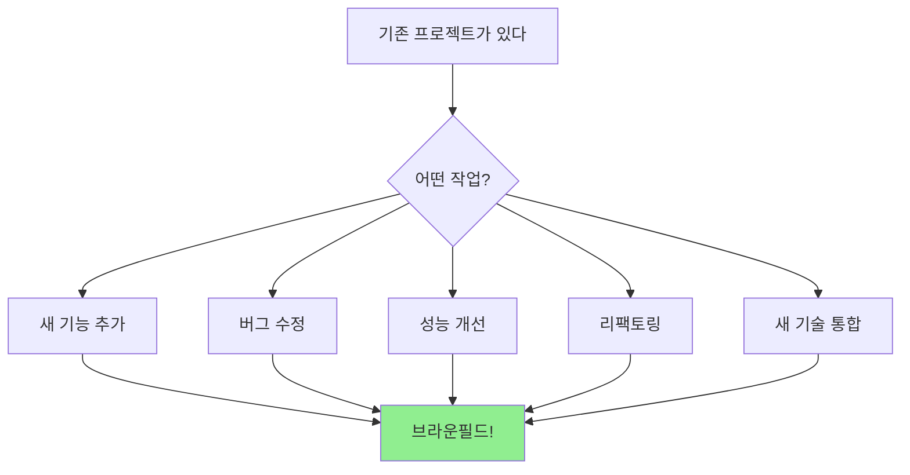
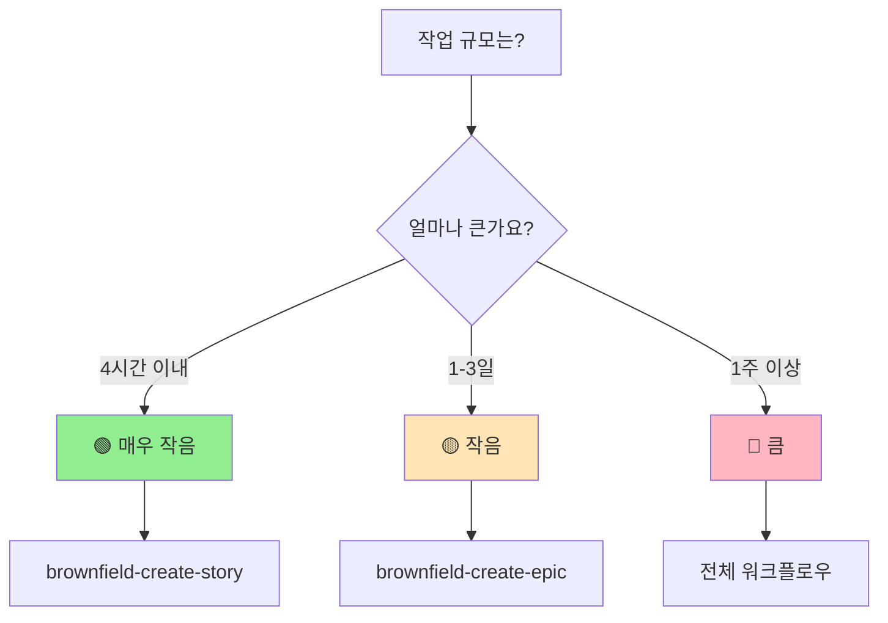
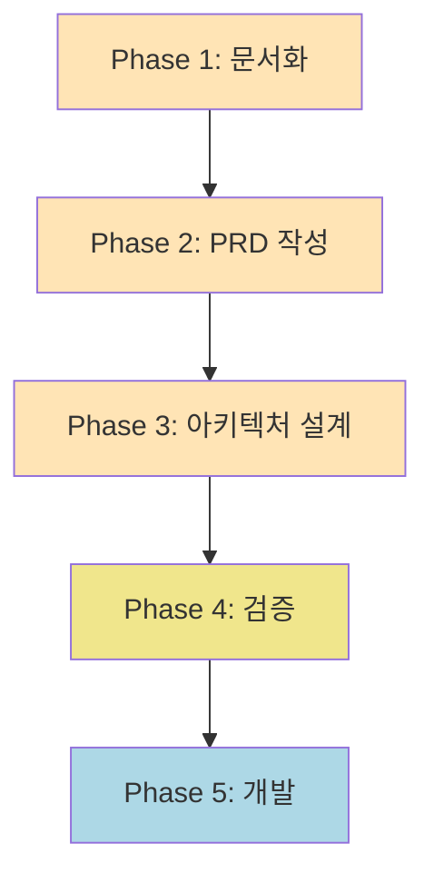
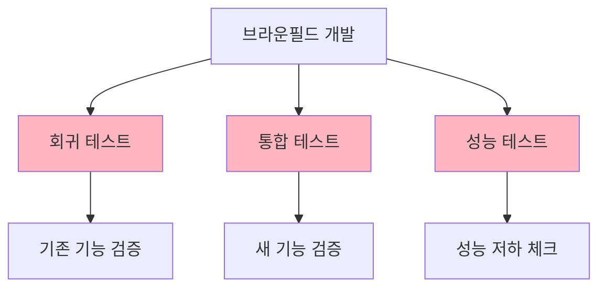
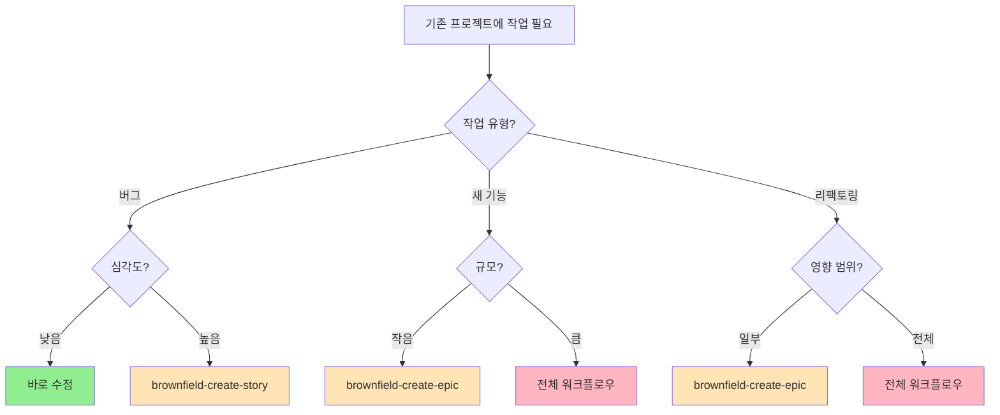

# 🏗️ BMAD Method™ 브라운필드 완벽 가이드: 기존 프로젝트 개선하기

## 🎯 브라운필드(Brownfield)란?

**브라운필드**는 건설 업계 용어에서 유래했습니다:

- 🏚️ **원래 의미**: 이미 건물이 있던 땅에 새로 짓기
- 💻 **IT 의미**: 기존 프로젝트에 새 기능 추가/개선하기

### 🆚 그린필드 vs 브라운필드

| 구분       | 그린필드 🌱 | 브라운필드 🏗️                   |
| ---------- | ----------- | ------------------------------- |
| **상황**   | 새 프로젝트 | 기존 프로젝트                   |
| **자유도** | 100% 자유   | 제약 많음                       |
| **속도**   | 빠른 개발   | 신중한 개발                     |
| **리스크** | 낮음        | 높음 (기존 기능 망가질 수 있음) |
| **문서화** | 새로 작성   | 기존 시스템 분석 필요           |

---

## 📌 언제 브라운필드를 사용하나요?

### ✅ **브라운필드 사용 케이스**



**실제 예시:**

- ✅ "기존 쇼핑몰에 토스페이 결제 추가"
- ✅ "레거시 jQuery 코드를 React로 전환"
- ✅ "기존 API에 새로운 엔드포인트 추가"
- ✅ "데이터베이스 마이그레이션"

### ❌ **브라운필드를 사용하지 않는 경우**

- ❌ **방금 MVP 완성 후 다음 Epic**: 기존 PRD에 Epic 추가
- ❌ **완전히 새로운 프로젝트**: Greenfield 사용
- ❌ **단순 설정 변경**: 문서 없이 바로 수정

---

## 🎯 브라운필드 3단계 접근법

### 📊 **작업 규모 측정하기**



### 🔍 **규모별 선택 가이드**

| 규모             | 시간       | 예시                             | 사용 방법                 |
| ---------------- | ---------- | -------------------------------- | ------------------------- |
| **🟢 매우 작음** | 4시간 이내 | 버그 수정, 작은 UI 변경          | `brownfield-create-story` |
| **🟡 작음**      | 1-3일      | 새 결제 방법, 새 API             | `brownfield-create-epic`  |
| **🔴 큼**        | 1주 이상   | 관리자 대시보드, 대규모 리팩토링 | 전체 워크플로우           |

---

## 📋 절차 1: 단일 스토리 (매우 작은 작업)

### 🎯 **언제 사용?**

- 🐛 버그 수정
- 🎨 작은 UI 개선
- 📝 텍스트 수정
- 🔧 설정 변경

### 💻 **실행 방법**

```bash
# 1. PM 에이전트 활성화
@pm

# 2. 브라운필드 스토리 생성
*brownfield-create-story
```

### 🤖 **PM이 물어볼 질문들**

```markdown
1. "정확히 무엇을 수정하나요?"
   예: "로그인 페이지 비밀번호 재설정 링크 버그"

2. "기존 시스템 어느 부분과 연결되나요?"
   예: "인증 시스템의 비밀번호 재설정 모듈"

3. "어떤 기술을 사용하나요?"
   예: "Next.js 14, Supabase Auth"

4. "성공 기준은?"
   예: "링크 클릭시 재설정 이메일 발송"
```

### 📄 **생성되는 문서**

```markdown
# Story 1.4: 비밀번호 재설정 링크 버그 수정

## 기존 시스템 통합

- 통합 대상: Supabase Auth 모듈
- 기술: Next.js 14, TypeScript
- 패턴: 기존 인증 패턴 따름
- 영향: auth/password-reset 엔드포인트

## Acceptance Criteria

1. 재설정 링크 클릭시 이메일 발송
2. 기존 로그인 기능 영향 없음
3. 에러 처리 개선

## 정의 완료 기준

- [ ] 기능 요구사항 충족
- [ ] 회귀 테스트 통과
- [ ] 기존 패턴 준수
```

---

## 📋 절차 2: 단일 에픽 (작은 기능)

### 🎯 **언제 사용?**

- 💳 새 결제 방법 추가
- 📊 새 리포트 기능
- 🔔 알림 시스템 추가
- 🌍 다국어 지원

### 💻 **실행 방법**

```bash
# 1. PM 에이전트 활성화
@pm

# 2. 브라운필드 에픽 생성
*brownfield-create-epic
```

### 🤖 **PM이 물어볼 질문들**

```markdown
1. "기존 프로젝트 목적과 현재 기능은?"
   예: "이커머스 플랫폼, 현재 카드/계좌이체 지원"

2. "추가할 기능 상세 설명?"
   예: "토스페이 결제 통합"

3. "기존 시스템과 어떻게 통합?"
   예: "기존 결제 모듈에 새 프로바이더 추가"

4. "주요 리스크는?"
   예: "결제 실패시 롤백, 이중 결제 방지"
```

### 📄 **생성되는 에픽 구조**

```markdown
# Epic 3: 토스페이 결제 통합

## Epic 목표

기존 결제 시스템에 토스페이 옵션 추가

## Stories

1. **Story 3.1**: 토스페이 SDK 통합
   - SDK 설치 및 초기화
   - 기존 결제 모듈과 연동

2. **Story 3.2**: 결제 UI 업데이트
   - 토스페이 버튼 추가
   - 결제 플로우 통합

3. **Story 3.3**: 백엔드 API 연동
   - 웹훅 처리
   - 결제 검증 로직

## 호환성 요구사항

- [ ] 기존 결제 방법 영향 없음
- [ ] 데이터베이스 스키마 호환
- [ ] UI 일관성 유지

## 리스크 완화

- 주요 리스크: 결제 실패 처리
- 완화 방법: 트랜잭션 롤백 구현
- 롤백 계획: 기능 플래그로 즉시 비활성화
```

---

## 📋 절차 3: 전체 브라운필드 워크플로우 (대규모)

### 🎯 **언제 사용?**

- 🏢 관리자 대시보드 추가
- 🔄 대규모 리팩토링
- 🏗️ 아키텍처 변경
- 🚀 새로운 주요 기능

### 🔄 **전체 워크플로우 5단계**



### 📚 **Phase 1: 기존 시스템 문서화**

**담당 에이전트**: @architect
**입력**: 프로젝트 코드베이스
**출력**: `docs/architecture/brownfield-current-state.md`
**승인자**: @po
**다음 단계 조건**: PO가 문서 완전성 승인

#### **옵션 A: PRD 우선 (대형 프로젝트용)**

```bash
# 1. 먼저 무엇을 만들지 정의
@pm
*create-brownfield-prd
# ✋ 사용자 승인 대기: PRD 내용 검토

# 2. PRD 기반으로 관련 부분만 문서화
@architect
*document-project
# ✋ 사용자 승인 대기: 문서화 완전성 검토
```

**장점:**

- ✅ 불필요한 문서화 방지
- ✅ 집중적인 분석
- ✅ 빠른 진행

**주의사항:**

- ⚠️ PRD 승인 없이 문서화 진행 금지
- ⚠️ 관련 시스템 누락 시 재분석 필요

#### **옵션 B: 전체 문서화 우선 (소형 프로젝트용)**

```bash
# 1. 전체 시스템 문서화
@architect
*document-project
# ✋ 사용자 승인 대기: 문서화 완전성 검토

# 2. 문서 기반으로 PRD 작성
@pm
*create-brownfield-prd
# ✋ 사용자 승인 대기: PRD 내용 검토
```

**장점:**

- ✅ 완전한 시스템 이해
- ✅ 숨겨진 의존성 발견
- ✅ 전체적인 관점

**주의사항:**

- ⚠️ 전체 문서화로 인한 시간 소요 증가
- ⚠️ 불필요한 분석 가능성

### 📄 **document-project가 생성하는 문서**

```markdown
# BeFun v3 브라운필드 아키텍처 문서

## 현재 시스템 상태

- 기술 스택: Next.js 14, Supabase, Three.js
- 주요 기능: 3D 컨피규레이터, 사용자 인증
- 기술 부채: jsdom 테스트 이슈

## 기술 부채 및 알려진 이슈

### 중요한 기술 부채

1. **테스트 환경**: jsdom에서 WebGL 테스트 불가
2. **번들 크기**: Three.js로 인한 초기 로딩 지연
3. **인증 시스템**: CSRF 토큰 검증 미흡

## 통합 포인트

- Frontend: /src/app/\* (App Router)
- Backend: Supabase Functions
- Database: PostgreSQL (Supabase)

## 개발 가이드

- 코딩 컨벤션: ESLint + Prettier
- 테스트: Vitest + Playwright
- 배포: Vercel
```

### 📝 **Phase 2: 브라운필드 PRD 작성**

**담당 에이전트**: @pm
**입력**: Phase 1 문서화 결과
**출력**: `docs/prd/brownfield-enhancement.md`
**승인자**: @po
**다음 단계 조건**: PO가 PRD 완전성 및 호환성 요구사항 승인

```bash
@pm
*create-brownfield-prd
# ✋ 사용자 승인 대기: PRD 검토 및 승인
```

**PM 체크리스트 (완전 이행 필수):**

- [ ] 기존 시스템 현황 분석 완료
- [ ] Enhancement 범위 명확히 정의
- [ ] 영향 평가 (최소/중간/주요) 완료
- [ ] 호환성 요구사항 4가지 이상 정의
- [ ] 리스크 식별 및 완화 방안 수립
- [ ] 롤백 계획 수립

**브라운필드 PRD 특징:**

```markdown
# 브라운필드 Enhancement PRD

## 기존 프로젝트 개요

- 현재 상태: 3D 컨피규레이터 MVP 완료
- 기술 스택: [document-project 참조]

## Enhancement 범위

### Enhancement 유형: 관리자 대시보드 추가

### 영향 평가:

- 최소 영향 (독립적 추가)
- 중간 영향 (일부 코드 수정)
- 주요 영향 (아키텍처 변경) ✅

## 호환성 요구사항

- CR1: 기존 API 호환성 유지
- CR2: 데이터베이스 스키마 하위 호환
- CR3: UI/UX 일관성 유지
- CR4: 성능 저하 없음

## 브라운필드 특화 제약사항

- 기존 코드 삭제 금지 (Deprecation 사용)
- API 버전 관리 필수 (/api/v2)
- 데이터 마이그레이션 롤백 가능해야 함
- 기능 플래그로 즉시 비활성화 가능해야 함
```

### 🏗️ **Phase 3: 아키텍처 계획 (필요시)**

**담당 에이전트**: @architect
**입력**: Phase 2 PRD
**출력**: `docs/architecture/brownfield-integration-plan.md`
**승인자**: @po + @dev (기술 검토)
**다음 단계 조건**: 아키텍처 변경이 기존 시스템에 안전하게 통합 가능함을 확인

**실행 조건:**

- PRD의 영향 평가가 "주요 영향 (아키텍처 변경)"인 경우
- 데이터베이스 스키마 변경이 필요한 경우
- 새로운 외부 시스템 통합이 필요한 경우

```bash
# PRD 검토 후 아키텍처 변경 필요시
@architect
*create-brownfield-architecture
# ✋ 사용자 승인 대기: 아키텍처 설계 검토
```

**Architect 체크리스트 (완전 이행 필수):**

- [ ] 기존 아키텍처와의 통합 전략 수립
- [ ] 코드/DB/API/UI 통합 계획 명시
- [ ] 마이그레이션 계획 수립
- [ ] 롤백 메커니즘 설계
- [ ] 성능 영향 평가
- [ ] 보안 영향 평가

**브라운필드 아키텍처 특징:**

```markdown
# 브라운필드 Enhancement 아키텍처

## 통합 전략

### 코드 통합: 기존 모듈 확장

### DB 통합: 새 테이블 추가 (기존 스키마 유지)

### API 통합: 버전 관리 (/api/v2)

### UI 통합: 기존 디자인 시스템 활용

## 리스크 완화

- 기능 플래그 사용 (LaunchDarkly/환경변수)
- 점진적 롤아웃 (10% → 50% → 100%)
- A/B 테스팅 (필요시)
- 롤백 계획 (1-click rollback)

## 데이터 마이그레이션

- 마이그레이션 스크립트: `migrations/202501_add_admin.sql`
- 롤백 스크립트: `migrations/202501_rollback_admin.sql`
- 테스트 계획: 스테이징 환경에서 전체 마이그레이션 검증
```

### ✅ **Phase 4: 검증**

**담당 에이전트**: @po
**입력**: Phase 1-3의 모든 문서
**출력**: 검증 결과 및 승인/거부 결정
**승인자**: 사용자 (프로젝트 오너)
**다음 단계 조건**: PO 체크리스트 100% 완료 + 사용자 최종 승인

```bash
@po
*execute-checklist-po
# ✋ 사용자 승인 대기: PO 검증 결과 최종 승인
```

**PO 체크리스트 (브라운필드 전용 - 완전 이행 필수):**

```markdown
## 브라운필드 검증 체크리스트

### 문서 완전성 (100% 필수)

- [ ] document-project 완료 및 승인
- [ ] PRD 완료 및 승인
- [ ] Architecture (필요시) 완료 및 승인
- [ ] 모든 문서 간 일관성 확인

### 통합 안전성

- [ ] 기존 기능 영향 분석 완료
- [ ] 롤백 전략 수립 및 테스트 계획
- [ ] 데이터 마이그레이션 계획 (필요시)
- [ ] 성능 영향 평가 (기준: 저하 5% 미만)

### 호환성 검증

- [ ] API 하위 호환성 확인
- [ ] DB 스키마 호환성 확인
- [ ] UI 일관성 확인
- [ ] 보안 정책 준수 확인

### 리스크 관리

- [ ] 주요 리스크 식별 (최소 3개)
- [ ] 각 리스크별 완화 방안 수립
- [ ] 비상 대응 계획 수립

### 승인 조건

- ✅ **PASS**: 모든 체크리스트 항목 완료 → Phase 5 진행
- ⚠️ **CONCERNS**: 일부 미흡 → 보완 후 재검증
- ❌ **FAIL**: 주요 문제 발견 → Phase 1-3 재수행
```

### 📂 **Phase 5: 문서 샤딩 및 개발**

**담당 에이전트**: @po (샤딩), @sm (스토리 생성), @dev (개발), @qa (검증)

#### **Step 5.1: 문서 샤딩 (조건부)**

**샤딩이 필요한 경우:**

- PRD 파일 크기가 50KB 이상
- Epic이 3개 이상 포함
- Story가 예상 10개 이상
- 여러 에이전트가 동시 작업 필요

**샤딩이 불필요한 경우:**

- 단일 Epic, 3개 이하 Story
- PRD가 간단하고 명확함
- 작업 기간 1주 이내

```bash
# 1. 문서 샤딩 (조건부)
@po
shard docs/prd.md
# ✋ 확인: Epic별로 분리된 파일 생성 확인

# 아키텍처 샤딩 (대규모 프로젝트만)
shard docs/architecture.md
# ✋ 확인: 모듈별로 분리된 파일 생성 확인
```

**샤딩 결과 예시:**

```
docs/prd/
├── epic-1-admin-dashboard.md
├── epic-2-reporting.md
└── epic-3-notifications.md
```

#### **Step 5.2: 스토리 생성**

```bash
# 2. 스토리 생성
@sm
*create
# ✋ 확인: 모든 스토리 파일이 docs/stories/에 생성되었는지 확인
```

**SM 체크리스트 (완전 이행 필수):**

- [ ] 각 Epic별로 Story 세분화
- [ ] 각 Story에 수락 기준 3개 이상
- [ ] 기존 시스템 통합 포인트 명시
- [ ] 회귀 테스트 요구사항 명시

#### **Step 5.3: 개발 사이클 (Story별 반복)**

```bash
# 3. Story별 개발 사이클
@dev
Story X.Y를 구현해주세요
# ✋ Dev 완료 대기

# 4. QA 검증 (각 Story 완료 후 필수)
@qa
*review-story X.Y
# ✋ QA Gate 결과 확인

# QA Gate 결과에 따른 조치:
# - PASS: 다음 Story 진행
# - CONCERNS: 개선 후 재검증
# - FAIL: Story 재작업 필수
```

**⚠️ 중요: Story별 QA Gate 통과 필수**

- 다음 Story 시작 전 반드시 현재 Story QA Gate 통과
- QA Gate 건너뛰고 다음 Story 진행 절대 금지
- 회귀 테스트 실패 시 즉시 작업 중단

---

## ⚠️ CRITICAL: 절차 준수 원칙

**브라운필드 개발에서 절차를 생략하거나 건너뛰는 것은 절대 금지됩니다.**

### 🚨 절대 금지 사항

1. **문서화 없이 코드 수정 금지**
   - `document-project` 또는 `brownfield-create-*` 필수 실행
   - 기존 시스템 이해 없이 개발 시작 금지

2. **에이전트 체크리스트 생략 금지**
   - 각 에이전트의 모든 체크리스트 항목 완료 후 다음 단계 진행
   - 효율성을 이유로 단계 축소 금지

3. **QA Gate 건너뛰기 금지**
   - 기존 기능 회귀 테스트 필수
   - QA 승인 없이 다음 Story 진행 금지

4. **롤백 계획 없이 배포 금지**
   - 모든 변경사항은 즉시 롤백 가능해야 함
   - 기능 플래그 또는 버전 관리 필수

5. **사용자 승인 없이 중요 단계 진행 금지**
   - PRD 승인, 아키텍처 승인, QA Gate 통과 시 사용자 확인 필수

### 📋 위반 시 즉시 조치

- 절차 생략 발견 시 **즉시 작업 중단**
- 누락된 절차를 완전히 수행한 후 진행
- 사용자에게 위반 사실 보고 및 승인 요청

---

## ⚠️ 브라운필드 4대 핵심 원칙

### 1️⃣ **항상 문서화 먼저**


**왜 중요한가?**

- AI 에이전트가 컨텍스트 파악
- 숨겨진 의존성 발견
- 기술 부채 식별

### 2️⃣ **기존 패턴 존중**

```markdown
## 따라야 할 것들

- ✅ 기존 코딩 컨벤션
- ✅ 기존 폴더 구조
- ✅ 기존 네이밍 규칙
- ✅ 기존 테스트 패턴

## 예시

# 기존 패턴

/src/components/ui/Button.tsx

# 새 컴포넌트도 동일하게

/src/components/ui/Modal.tsx ✅
/components/Modal.tsx ❌
```

### 3️⃣ **점진적 롤아웃**

```typescript
// 기능 플래그 사용
if (featureFlags.newDashboard) {
  return <NewDashboard />
} else {
  return <OldDashboard />
}
```

**단계별 배포:**

1. 개발 환경 테스트
2. 스테이징 배포
3. 10% 사용자 배포
4. 50% 사용자 배포
5. 100% 배포

### 4️⃣ **테스트 강화 (QA 필수)**



---

## 🧪 브라운필드 QA 전략

### 📊 **QA 에이전트 활용 시점 (브라운필드 필수)**

**브라운필드에서는 QA가 더욱 중요합니다. 기존 기능을 보호하기 위해 각 단계별 QA 검증이 필수입니다.**

```bash
# 1. 개발 전 - 리스크 평가 (필수)
@qa *risk-profile 3.1
# → 통합 리스크 식별
# → 기존 기능 영향 범위 파악
# ✋ 확인: 고위험 항목 확인 및 완화 방안 수립

# 2. 개발 중 - 검증 (권장)
@qa *trace-requirements 3.1
# → 요구사항 충족 확인
# → 호환성 요구사항 추적

@qa *nfr-assess 3.1
# → 성능 저하 체크
# → 기준: 5% 이내 저하

# 3. 개발 후 - 종합 리뷰 (필수)
@qa *review-story 3.1
# → 코드 품질 검증
# → 회귀 테스트 결과 확인
# ✋ 확인: 모든 테스트 통과 확인

@qa *qa-gate 3.1
# → 배포 가능 여부 최종 결정
# ✋ 확인: PASS/CONCERNS/FAIL 결과 확인
```

**⚠️ QA Gate 건너뛰기 절대 금지**

- 모든 Story는 QA Gate 통과 필수
- FAIL 시 재작업 후 재검증
- CONCERNS 시 리스크 수용 여부 사용자 결정

### 📈 **QA Gate 통과 기준 (브라운필드 특화)**

#### **PASS 조건 (즉시 다음 Story 진행 가능)**

```markdown
필수 조건 (모두 충족):

- [ ] 모든 단위 테스트 통과
- [ ] 모든 통합 테스트 통과
- [ ] **모든 회귀 테스트 통과** (브라운필드 필수)
- [ ] 성능 저하 5% 미만
- [ ] 보안 취약점 없음
- [ ] 코드 리뷰 승인
- [ ] 기존 API 호환성 100%
```

#### **CONCERNS 조건 (조건부 통과)**

```markdown
경미한 문제 존재:

- [ ] 회귀 테스트 통과 (필수)
- [ ] 성능 저하 5-10% (문서화 필요)
- [ ] 비핵심 기능 영향 (롤백 가능)
- [ ] 기술 부채 증가 (개선 계획 수립)
- [ ] 코드 품질 일부 미흡 (리팩토링 계획 수립)

조치:

- 사용자에게 리스크 보고
- 리스크 수용 여부 확인
- 수용 시 개선 계획 수립 후 진행
```

#### **FAIL 조건 (배포 금지)**

```markdown
심각한 문제 발견:

- [ ] 회귀 테스트 실패
- [ ] 기존 기능 손상
- [ ] 성능 저하 10% 이상
- [ ] 보안 취약점 발견
- [ ] 데이터 손실 가능성
- [ ] 롤백 불가능
- [ ] 기존 API 호환성 손상

조치:

- 즉시 작업 중단
- Story 재작업
- 완료 후 재검증
```

### 📈 **QA 리포트 예시**

```yaml
# QA Gate Decision
gate: CONCERNS
story: '3.1'
story_title: '토스페이 SDK 통합'

# 브라운필드 핵심 검증 항목
regression_tests:
  status: PASS
  coverage: 100%
  note: '기존 카드/계좌이체 결제 모두 정상'

compatibility:
  api: PASS (100% 호환)
  database: PASS (스키마 변경 없음)
  ui: PASS (기존 디자인 시스템 준수)

top_issues:
  - id: 'REG-001'
    severity: high
    finding: '기존 결제 모듈과 충돌 가능성'
    suggested_action: '통합 테스트 강화'
    status: '완화 계획 수립됨'

  - id: 'PERF-001'
    severity: medium
    finding: 'SDK 로딩으로 번들 크기 증가 (7%)'
    suggested_action: '동적 임포트 적용'
    status: '개선 계획 수립됨'

recommendations:
  immediate:
    - '회귀 테스트 실행 완료 ✅'
    - '성능 벤치마크 측정 필요'
  future:
    - '결제 모듈 리팩토링 고려'

decision:
  result: CONCERNS
  reason: '성능 저하 7% (기준 5% 초과)'
  action: '사용자 승인 필요 - 리스크 수용 여부 결정'
```

---

## 🎓 실전 예시 3가지

### 예시 1: 버그 수정 (4시간)

```bash
# 문제: 비밀번호 재설정 링크 오류

# 1. 단일 스토리 생성
@pm
*brownfield-create-story

# PM 답변:
- 수정 내용: "재설정 링크 404 에러"
- 연결 시스템: "Supabase Auth"
- 성공 기준: "이메일 발송 성공"

# 2. 바로 개발
@dev
Story 1.4 구현해주세요

# 3. QA 검증
@qa
*review-story 1.4
```

### 예시 2: 토스페이 통합 (3일)

```bash
# 목표: 새 결제 방법 추가

# 1. 에픽 생성
@pm
*brownfield-create-epic

# PM 답변:
- 기능: "토스페이 결제 추가"
- 통합: "기존 결제 모듈 확장"
- 리스크: "결제 실패 처리"

# 2. 스토리별 개발
@sm *create  # Story 3.1: SDK 통합
@dev         # 개발
@qa *review  # 검증

@sm *create  # Story 3.2: UI 업데이트
@dev         # 개발
@qa *review  # 검증
```

### 예시 3: 관리자 대시보드 (2주)

```bash
# 목표: 전체 관리 시스템 추가

# 1. 시스템 분석
@architect
*document-project

# 2. PRD 작성
@pm
*create-brownfield-prd

# 3. 아키텍처 설계
@architect
*create-brownfield-architecture

# 4. 검증
@po
*execute-checklist-po

# 5. 개발 시작
@po shard docs/prd.md
@sm *create
# ... 여러 스토리 반복
```

---

## 📊 브라운필드 의사결정 플로우차트



---

## 💡 브라운필드 성공 팁

### ✅ **Do's (해야 할 것)**

1. **📚 충분한 분석**
   - document-project로 시스템 완전 이해
   - 숨겨진 의존성 찾기
   - 기술 부채 파악

2. **🔄 점진적 접근**
   - 작은 단위로 나누기
   - 기능 플래그 활용
   - 단계별 배포

3. **🧪 철저한 테스트**
   - 회귀 테스트 필수
   - 통합 테스트 강화
   - 성능 모니터링

4. **📝 문서화**
   - 변경사항 상세 기록
   - 롤백 계획 문서화
   - 학습 내용 공유

### ❌ **Don'ts (하지 말아야 할 것)**

1. **🚫 성급한 변경**
   - 분석 없이 시작 금지
   - 한 번에 모든 것 변경 금지
   - 테스트 없이 배포 금지

2. **🚫 기존 무시**
   - 기존 패턴 무시 금지
   - 기존 테스트 삭제 금지
   - 하위 호환성 무시 금지

3. **🚫 소통 부재**
   - 팀원과 소통 없이 진행 금지
   - 사용자 알림 없이 변경 금지
   - 문서 없이 배포 금지

---

## 🎯 정리: 브라운필드 핵심 요약

### 📌 **기억해야 할 3가지**

1. **규모에 맞는 접근**
   - 작음 → 스토리
   - 중간 → 에픽
   - 큼 → 전체 워크플로우

2. **문서화가 생명**
   - 이해 → 계획 → 실행
   - document-project 필수

3. **안전이 최우선**
   - 기존 기능 보호
   - 점진적 롤아웃
   - 롤백 계획

### 🚀 **다음 단계**

```bash
# 1. 작업 규모 결정
"이 작업은 얼마나 걸릴까?"

# 2. 적절한 방법 선택
- 4시간 → brownfield-create-story
- 1-3일 → brownfield-create-epic
- 1주+ → 전체 워크플로우

# 3. 실행
@pm
*brownfield-create-[story|epic]

# 또는

@architect
*document-project
```

**질문이 있으신가요?**

작업하실 기능의 규모를 알려주시면, 적절한 브라운필드 절차를 추천해드리겠습니다! 🎉

---

### 📚 추가 참고 자료

- **상세 가이드**: `.bmad-core/working-in-the-brownfield.md`
- **워크플로우 정의**: `.bmad-core/workflows/brownfield-*.yaml`
- **태스크 문서**: `.bmad-core/tasks/brownfield-*.md`
- **템플릿**: `.bmad-core/templates/brownfield-*.yaml`

---

## 📋 부록: 에이전트별 역할 및 핸드오프

### 에이전트 역할 매트릭스

| Phase | 에이전트   | 역할          | 입력             | 출력                           | 승인자     | 다음 단계 조건       |
| ----- | ---------- | ------------- | ---------------- | ------------------------------ | ---------- | -------------------- |
| 1     | @architect | 시스템 문서화 | 코드베이스       | brownfield-current-state.md    | @po        | 문서 완전성 승인     |
| 2     | @pm        | PRD 작성      | Phase 1 문서     | brownfield-enhancement.md      | @po        | PRD 승인             |
| 3     | @architect | 아키텍처 설계 | Phase 2 PRD      | brownfield-integration-plan.md | @po + @dev | 아키텍처 승인        |
| 4     | @po        | 검증          | Phase 1-3 문서   | 검증 결과                      | 사용자     | 체크리스트 100% 완료 |
| 5.1   | @po        | 문서 샤딩     | PRD/Architecture | Epic별 분리 파일               | -          | 파일 생성 확인       |
| 5.2   | @sm        | 스토리 생성   | Epic 문서        | Story 파일들                   | @po        | Story 완전성 검토    |
| 5.3   | @dev       | 개발          | Story            | 구현 코드                      | @qa        | 코드 완성            |
| 5.3   | @qa        | 검증          | 구현 코드        | QA Gate 결과                   | 사용자     | PASS/CONCERNS 승인   |

### 에이전트 간 핸드오프 포인트

```mermaid
graph TD
    A[@architect<br/>문서화] -->|문서 승인| B[@pm<br/>PRD 작성]
    B -->|PRD 승인| C{아키텍처<br/>변경?}
    C -->|Yes| D[@architect<br/>설계]
    C -->|No| E[@po<br/>검증]
    D -->|설계 승인| E
    E -->|검증 PASS| F[@po<br/>샤딩]
    F --> G[@sm<br/>스토리 생성]
    G --> H[@dev<br/>개발]
    H --> I[@qa<br/>검증]
    I -->|PASS| J{더 있나?}
    I -->|CONCERNS| K[사용자<br/>승인]
    I -->|FAIL| H
    K -->|승인| J
    K -->|거부| H
    J -->|Yes| G
    J -->|No| L[완료]

    style A fill:#FFE4B5
    style B fill:#FFE4B5
    style D fill:#FFE4B5
    style E fill:#F0E68C
    style F fill:#ADD8E6
    style G fill:#ADD8E6
    style H fill:#90EE90
    style I fill:#FFB6C1
    style L fill:#98FB98
```

### 각 핸드오프에서 확인해야 할 것

1. **@architect → @pm**
   - [ ] 기존 시스템 현황 명확히 문서화
   - [ ] 기술 부채 식별
   - [ ] 통합 포인트 명시

2. **@pm → @architect (조건부)**
   - [ ] PRD의 Enhancement 범위 명확
   - [ ] 영향 평가 "주요 영향" 확인
   - [ ] 호환성 요구사항 정의

3. **@architect/@pm → @po**
   - [ ] 모든 필수 문서 완성
   - [ ] 문서 간 일관성 확인
   - [ ] 롤백 계획 수립

4. **@po → @sm**
   - [ ] Epic별 파일 분리 (필요시)
   - [ ] 각 Epic의 범위 명확
   - [ ] Story 세분화 가이드

5. **@sm → @dev**
   - [ ] Story 수락 기준 명확
   - [ ] 통합 포인트 명시
   - [ ] 회귀 테스트 요구사항

6. **@dev → @qa**
   - [ ] 구현 완료
   - [ ] 단위 테스트 통과
   - [ ] 자체 검증 완료

7. **@qa → 다음 Story**
   - [ ] QA Gate PASS 또는 CONCERNS (승인됨)
   - [ ] 회귀 테스트 통과 필수
   - [ ] 문서 업데이트 완료
