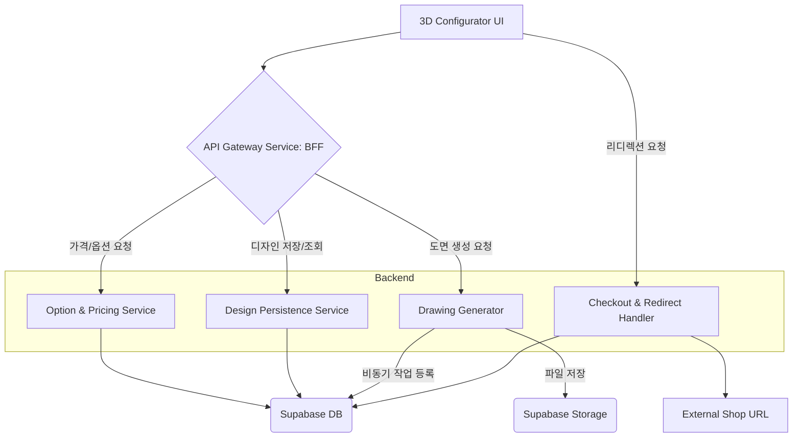

# 🛋️ 3D 책상 컨피규레이터 플랫폼 Fullstack Architecture Document

## Introduction
이 문서는 **"3D 책상 컨피규레이터 플랫폼"** 프로젝트의 전체 풀스택 아키텍처를 정의합니다. PM이 정의한 요구사항과 UX/UI 사양을 충족하기 위해, 백엔드 시스템, 프런트엔드 구현, 그리고 이들의 통합 방식을 모두 포괄합니다. 이 문서는 개발팀의 **단일 정보 소스(Single Source of Truth)** 역할을 하여, 프로젝트 전체의 기술적 일관성을 보장합니다.

### 핵심 아키텍처 전략
1. **통합 구조**: 프런트엔드와 백엔드를 하나의 저장소에서 관리하는 **모노레포(Monorepo)** 구조를 채택하여 코드 공유 및 관리를 최적화합니다.
2. **클라우드 네이티브**: **Vercel**의 호스팅 환경에 최적화된 **서버리스(Serverless)** 아키텍처를 활용하여 확장성과 비용 효율성을 확보합니다.
3. **핵심 기술**: 프런트엔드는 **Three.js**와 **Next.js**를 사용하고, 백엔드는 **Node.js**와 **Supabase**를 활용합니다.

## High Level Architecture

### Technical Summary
이 시스템은 Vercel 환경에 최적화된 **서버리스(Serverless)** 기반의 **모노레포(Monorepo)** 구조를 채택합니다. 프런트엔드는 **Three.js**를 사용하여 고성능 3D 컨피규레이터를 구현하며, 백엔드 로직(실시간 가격 계산, 도면 생성 등)은 Node.js 서버리스 함수로 개발됩니다. 데이터 및 사용자 관리는 **Supabase**를 핵심 서비스로 활용하여, 빠르고 확장 가능한 풀스택 애플리케이션을 구축하는 것이 목표입니다.

### High Level Overview
1. **아키텍처 스타일**: **서버리스(Serverless)** 기반의 **모노레포(Monorepo)** 구조입니다.
2. **BE/FE 통합**: **BFF (Backend For Frontend)** 패턴을 도입하여 프런트엔드의 복잡도를 낮춥니다.
3. **결제 전략**: **단순 전환 모델(리디렉션)**을 통해 기존 쇼핑몰 API와의 복잡한 통합을 회피합니다.

### High Level Project Diagram (고도화된 최종 다이어그램)

## Tech Stack (안정 버전 확정)

| 분류 | 기술 | 버전 (구체화된 안정 버전) | 목적 | 선택 근거 |
| :--- | :--- | :--- | :--- | :--- |
| **FE 언어** | **TypeScript** | **5.3.x** | 타입 안정성 및 코드 품질 확보 | 현재 널리 사용되는 안정 버전 |
| **FE 프레임워크** | **Next.js** | **14.x** | Vercel 호스팅 및 모노레포 구축에 최적화 | 최신 기능과 안정성 확보 |
| **3D 렌더링** | **Three.js** | **r169** | 고성능 웹 3D 컨피규레이터 구현 | 안정성이 검증된 특정 버전으로 고정 |
| **UI/스타일링** | **Tailwind CSS** | **3.x** | 일관된 디자인 시스템 구축 및 빠른 UI 개발 | 널리 사용되며 Next.js와 호환성이 높음 |
| **BE 언어/런타임** | **Node.js** | **v20.x (LTS)** | Vercel Serverless Functions 환경에 최적화 | 현재 가장 안정적으로 지원되는 LTS 버전 |
| **데이터/Auth** | **Supabase** | **PostgreSQL 15** | DB, **사용자 인증**, 파일 저장소 제공 | 인증 기능 제공 및 Vercel 환경과의 시너지 |
| **API 스타일** | **REST API** | OpenAPI 3.0 | 클라이언트-서버 간 데이터 교환 표준 | 서비스 개발에 가장 일반적이고 효율적 |

## Data Models (확장성 및 보안 강화)

### Saved_Design (핵심 모델)

  * **`custom_specs`**: `JSONB` 타입으로 저장 (유연성 확보).
  * **핵심 속성 분리**: `width_cm`, `depth_cm`, `material` 등 **검색/분석에 사용될 핵심 속성**은 별도 컬럼으로 분리하여 **DB 쿼리 성능을 향상**합니다.
  * **RLS (Row Level Security)**: **Supabase의 RLS 정책**을 활성화하여 로그인한 사용자만 자신의 디자인 데이터에 접근하도록 **보안을 강화**합니다.

## Component Analysis: 선택 근거 및 위험 분석

| 설계 항목 | 주요 결정 | 선택 근거 (Rationale) | 위험 요소 (Risks) | 대응 방안 (Mitigation) |
| :--- | :--- | :--- | :--- | :--- |
| **아키텍처 스타일** | **Serverless + Monorepo** | Vercel 호스팅에 최적화. 공유 코드 관리가 용이함. | **Cold Start 지연** 발생 시 UX 저하. | **Warm-up 전략** 도입 및 Next.js Serverless Functions 최적화. |
| **결제 통합 모델** | **단순 전환 (리디렉션)** | 레거시 쇼핑몰 API **통합 위험**을 획기적으로 낮춤. | **리디렉션 URL 패키징 오류** 시 구매 실패. | **MVP 첫 번째 스토리**에서 리디렉션 로직을 **최우선 검증**. |
| **핵심 컴포넌트 구조** | **BFF (API Gateway Service)** 도입 | `3D Configurator UI`의 복잡성을 제거하고, API 통합 로직을 중앙 집중화. | BFF 계층의 추가적인 지연 시간 발생 가능성. | BFF에서 **캐싱 전략**을 사용하여 주요 데이터 조회 속도를 최적화. |
| **도면 생성 (FR3)** | **비동기 처리 도입** | Vercel Serverless **실행 시간 제한** 초과 위험 회피. | 도면 완성까지 사용자가 기다려야 하는 UX 저하. | **즉각적인 피드백(토스트 메시지)** 및 **이메일/알림**으로 진행 상황 명확히 전달. |