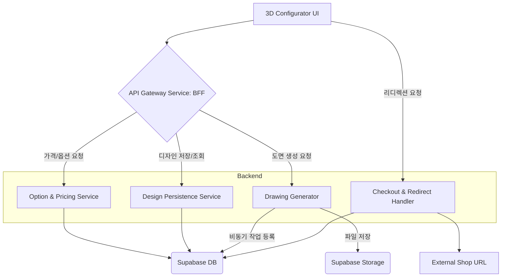

# High Level Architecture

## Technical Summary
이 시스템은 Vercel 환경에 최적화된 **서버리스(Serverless)** 기반의 **모노레포(Monorepo)** 구조를 채택합니다. 프런트엔드는 **Three.js**를 사용하여 고성능 3D 컨피규레이터를 구현하며, 백엔드 로직(실시간 가격 계산, 도면 생성 등)은 Node.js 서버리스 함수로 개발됩니다. 데이터 및 사용자 관리는 **Supabase**를 핵심 서비스로 활용하여, 빠르고 확장 가능한 풀스택 애플리케이션을 구축하는 것이 목표입니다.

## High Level Overview
1. **아키텍처 스타일**: **서버리스(Serverless)** 기반의 **모노레포(Monorepo)** 구조입니다.
2. **BE/FE 통합**: **BFF (Backend For Frontend)** 패턴을 도입하여 프런트엔드의 복잡도를 낮춥니다.
3. **결제 전략**: **단순 전환 모델(리디렉션)**을 통해 기존 쇼핑몰 API와의 복잡한 통합을 회피합니다.

## High Level Project Diagram (고도화된 최종 다이어그램)

