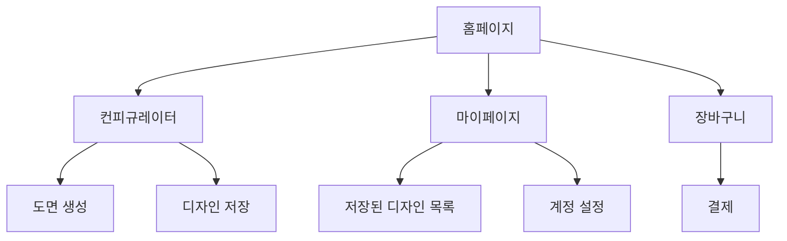
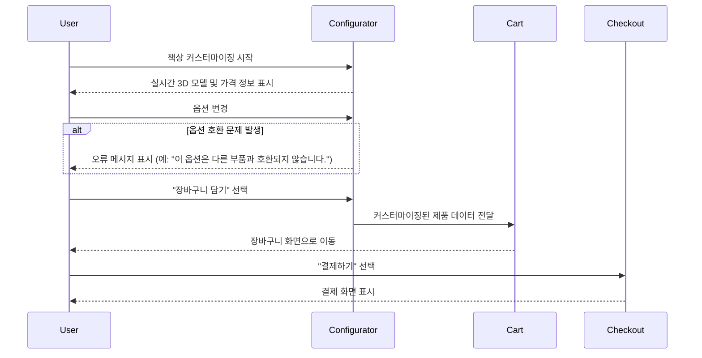

# 🛋️ 3D 책상 컨피규레이터 플랫폼 UI/UX Specification

## Overall UX Goals & Principles
### Target User Personas 및 핵심 사용자 여정
* **파워 유저**: 핵심 여정은 '정확한 치수와 재료를 조합하여 기술 도면을 생성'하는 것입니다.
* **일반 사용자**: 핵심 여정은 '시각적인 3D 컨피규레이터를 활용하여 나에게 맞는 책상을 커스터마이징하고 구매'하는 것입니다.

### 핵심 사용성 목표 (Usability Goals) 및 측정 지표
* **학습 용이성**: 신규 사용자가 3D 컨피규레이터의 핵심 기능을 3분 이내에 이해하고 사용할 수 있도록 합니다.
* **효율성**: 파워 유저가 최소한의 클릭으로 자주 사용하는 작업을 완료할 수 있도록 합니다.
* **오류 방지**: 중요한 작업 시에는 명확한 확인 절차를 제공하여 실수를 방지합니다.

### 핵심 디자인 원칙
* **즉각적인 피드백과 마이크로 인터랙션**: 모든 사용자 상호작용에 대해 명확하고 즉각적인 반응을 제공합니다. (예: 옵션 변경 시 3D 모델의 부드러운 전환 효과)
* **브랜딩 일관성**: 미니멀리즘, 따뜻함과 같은 브랜드의 핵심 가치를 정의하고, 그에 맞는 시각적 가이드라인을 설정합니다.
* **모바일 성능 최적화**: 모바일 환경에서 30 FPS 이상의 렌더링 성능을 유지하기 위해, 3D 모델의 복잡도를 낮추는 기술을 적용합니다.

## Information Architecture (IA)

### Site Map / Screen Inventory

### User Flows

##### 핵심 사용자 흐름: 책상 커스터마이징 및 구매

### Edge Cases 및 오류 처리

  * **미로그인 사용자의 디자인 저장**: 로그인하지 않은 사용자가 '디자인 저장' 버튼을 누르면, **먼저 로그인 또는 회원가입을 유도**하는 팝업 메시지를 표시합니다.
  * **옵션 호환성 오류**: 특정 옵션이 다른 옵션과 호환되지 않을 경우, 오류를 발생시키기보다 **호환 가능한 옵션만 활성화**하여 사용자 실수를 사전에 방지합니다.

## Component Library / Design System

### 디자인 시스템 접근법 (Design System Approach)

  * **코드 기반 디자인 시스템**: **Tailwind CSS**를 기반으로 하는 **Shadcn/ui**와 같은 솔루션을 활용합니다.
  * **Figma 활용**: Figma에서 **재사용 가능한 컴포넌트 라이브러리**를 구축하여 디자인 가이드라인을 시각적으로 관리합니다.

### 핵심 컴포넌트 (Core Components) 최종안

| 컴포넌트 | 용도 및 기능 | 중요한 상태/변형 |
| :--- | :--- | :--- |
| **버튼 (Button)** | 사용자 액션에 사용됩니다. | Primary, Secondary, Disabled 상태 |
| **슬라이더 (Slider)** | 책상의 크기 조절의 주요 입력 도구입니다. | 정밀한 값 입력을 위해 **수치 입력기(Numeric Input)**와 결합되어야 합니다. |
| **토스트 메시지 (Toast Message)** | '디자인이 저장되었습니다'와 같은 성공 피드백을 표시합니다. | Success, Error, Warning 유형 |

## Branding & Style Guide

### 컬러 팔레트 (Green-Toned)

| 색상 유형 | HEX 코드 (예시) |
| :--- | :--- |
| **Primary (주요 색상)** | `#3D6847` (차분하고 따뜻한 그린) |
| **Secondary (보조 색상)** | `#D9E8DD` (밝은 그린 계열) |

### 타이포그래피 (Typography)

  * **Primary Font**: **Pretendard** (무료 오픈소스)를 사용합니다.

## Accessibility Requirements

### 준수 표준 (Compliance Target)

  * **표준**: **WCAG(Web Content Accessibility Guidelines) 2.1 AA 레벨**을 준수합니다.

### 핵심 요구 사항 (Key Requirements)

| 범주 | 요구사항 | 구체적인 구현 지침 |
| :--- | :--- | :--- |
| **시각 (Visual)** | **색상 대비** | 핵심 텍스트와 배경 간의 대비율은 **최소 4.5:1**을 충족해야 합니다. |
| **상호작용 (Interaction)** | **키보드 접근성** | 3D 컨피규레이터의 옵션 선택 패널 내 모든 컨트롤은 **키보드 Tab 순서**에 따라 논리적으로 접근 및 조작 가능해야 합니다. |
| **콘텐츠 (Content)** | **대체 텍스트** | 3D 모델링의 핵심 정보는 스크린 리더가 읽을 수 있는 **비대체 텍스트(Alt-Text) 또는 ARIA 라벨**로 제공되어야 합니다. |

## Responsiveness Strategy

### Breakpoints

| Breakpoint | 최소 너비 | 핵심 레이아웃 전략 |
| :--- | :--- | :--- |
| **Mobile** | 320px | 3D 모델 **전체 화면** 몰입, 옵션 패널 **바텀 시트** |
| **Desktop** | 1024px | 3D 모델 중앙, 옵션 패널 **고정 배치** |

### 적응 패턴 및 조작성

  * **콘텐츠 우선순위**: **'실시간 가격'** 정보는 3D 뷰포트 위에 항상 고정된 **비침범적 컴포넌트**로 표시되어 가려지지 않습니다.
  * **조작 민감도 기준**: **1cm 스와이프당 15도 ~ 20도 회전** (모바일) 등 수치적 기준을 명시하여 조작감을 확보합니다.

## Next Steps

(이 섹션은 PRD에 있는 최종 프롬프트로 대체됩니다.)