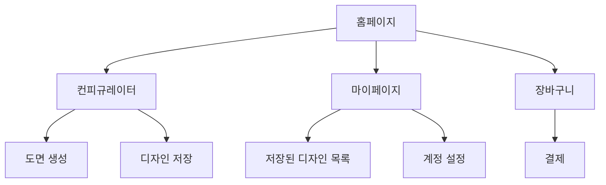
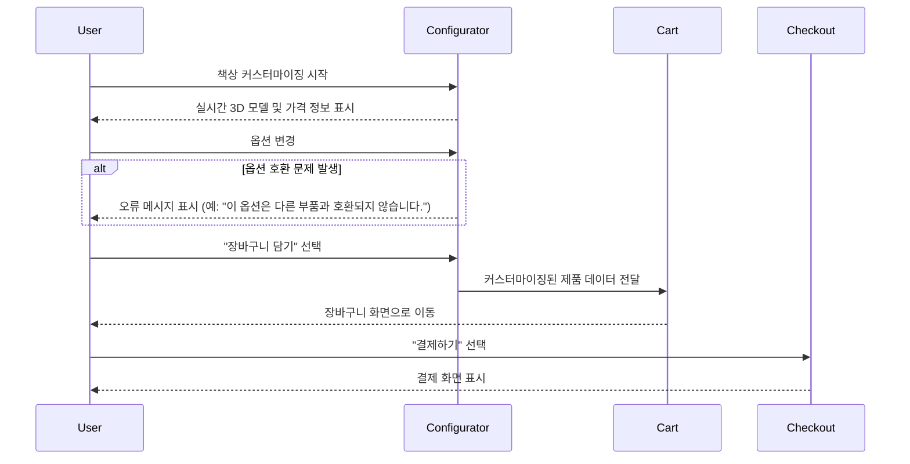

# Information Architecture (IA)

## Site Map / Screen Inventory

## User Flows

#### 핵심 사용자 흐름: 책상 커스터마이징 및 구매

## Edge Cases 및 오류 처리

  * **미로그인 사용자의 디자인 저장**: 로그인하지 않은 사용자가 '디자인 저장' 버튼을 누르면, **먼저 로그인 또는 회원가입을 유도**하는 팝업 메시지를 표시합니다.
  * **옵션 호환성 오류**: 특정 옵션이 다른 옵션과 호환되지 않을 경우, 오류를 발생시키기보다 **호환 가능한 옵션만 활성화**하여 사용자 실수를 사전에 방지합니다.
